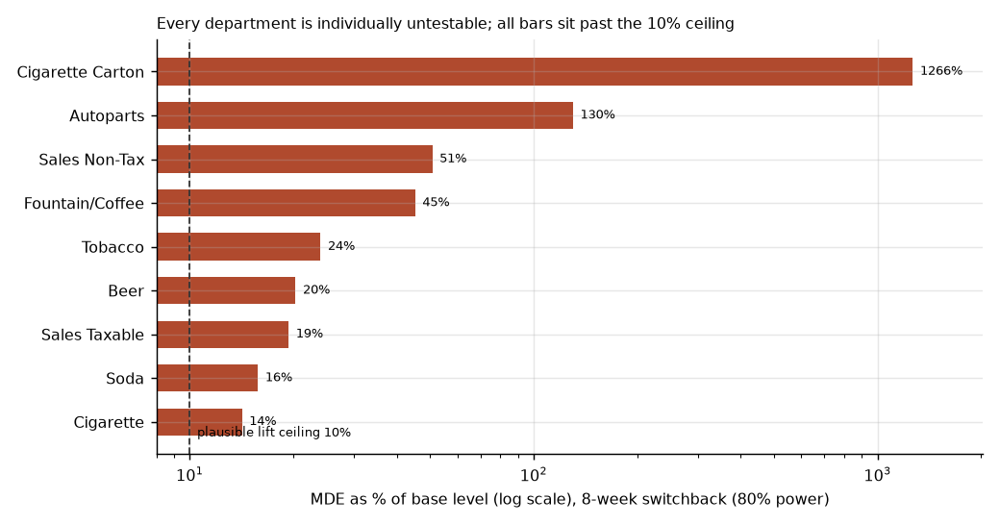
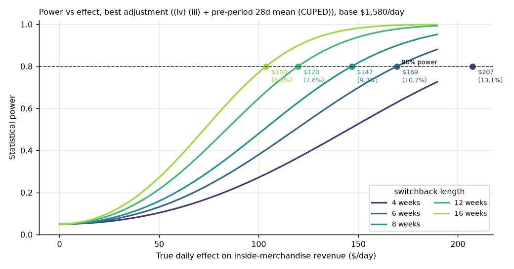
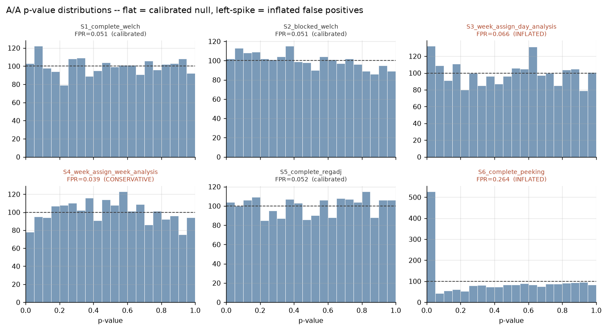
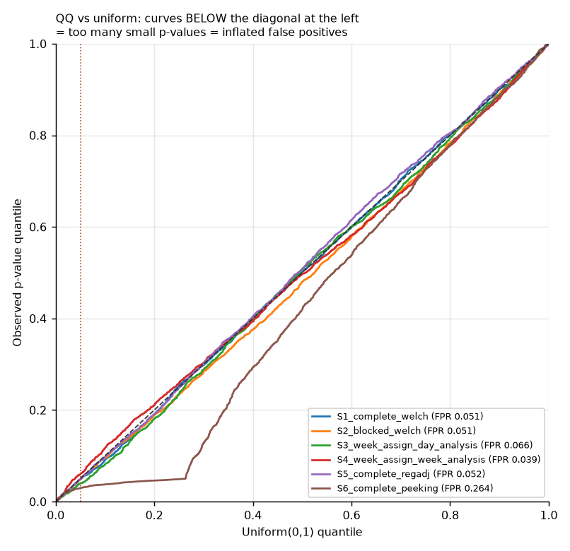

# Experiment Results — Power Analysis & A/A Calibration

**No treatment was ever applied to this store. There is no experiment in this
data.** This document reports two pieces of *offline* work on historical
observational data: (A) how large an effect a switchback could detect, and (B)
whether the planned analysis pipeline holds its nominal 5% error rate when fed a
known null. Every number below is produced by code in this repo and can be
re-run; none of it is evidence that any promotion works.

Reproduce:

```bash
python scripts/06_power_analysis.py   # Part A  (tables + fig5, fig6)
python scripts/07_aa_test.py          # Part B  (tables + fig7, fig8)
```

Design and pre-registered analysis plan: [`EXPERIMENT_DESIGN.md`](EXPERIMENT_DESIGN.md).

---

## Part A — Power analysis

All figures use the **trailing 52 weeks** (2025-01-02 … 2025-12-31, 364 days) so
they reflect the store as it is now, not the 2021–22 post-break ramp. MDE = the
smallest true daily effect detectable at **80% power, α = 0.05 two-sided**, for a
balanced day-level switchback.

### A1. Feasibility triage — only the aggregate is testable

Per-department daily mean, standard deviation, coefficient of variation, revenue
share, and MDE as a percentage of that department's own base level:

| Metric | Mean \$/day | SD | CV | Share | MDE% 4w | 6w | 8w | 12w | 16w | Testable? |
|---|--:|--:|--:|--:|--:|--:|--:|--:|--:|:--:|
| Cigarette | 394 | 75 | 0.19 | 3.5% | 20.0 | 16.4 | 14.2 | 11.6 | 10.0 | no |
| Beer | 267 | 72 | 0.27 | 2.4% | 28.7 | 23.4 | 20.3 | 16.6 | 14.4 | no |
| Soda | 225 | 47 | 0.21 | 2.0% | 22.3 | 18.2 | 15.8 | 12.9 | 11.2 | no |
| Sales Taxable | 423 | 109 | 0.26 | 3.8% | 27.4 | 22.4 | 19.4 | 15.8 | 13.7 | no |
| Sales Non-Tax | 62 | 42 | 0.68 | 0.6% | 71.7 | 58.5 | 50.7 | 41.4 | 35.8 | no |
| Fountain/Coffee | 22 | 13 | 0.60 | 0.2% | 63.9 | 52.2 | 45.2 | 36.9 | 32.0 | no |
| Autoparts | 7 | 12 | 1.74 | 0.1% | 183.9 | 150.2 | 130.1 | 106.2 | 92.0 | no |
| Cigarette Carton | 0.3 | 5 | 16.9 | 0.0% | 1790 | 1462 | 1266 | 1034 | 895 | no |
| Tobacco | 182 | 58 | 0.32 | 1.6% | 33.9 | 27.7 | 24.0 | 19.6 | 17.0 | no |
| **inside_merch (all 9)** | **1,580** | **227** | **0.14** | **14.2%** | **15.2** | **12.4** | **10.7** | **8.8** | **7.6** | **yes** |

**Finding.** Against a plausible-lift ceiling of 10% (a generous upper bound for
what a single-category drink promo could do to a department, set in
`config.PLAUSIBLE_MAX_LIFT_PCT`), **every individual department is untestable at
any duration up to 16 weeks.** Their MDEs exceed any effect the promotion could
realistically produce. Aggregation is what buys the signal: pooling the nine
departments cuts the CV from 0.19–16.9 down to 0.14, because department-level
noise partly cancels. The primary metric therefore *must* be the aggregate
`inside_merch`. The individual departments are reported to show the reasoning,
not because any of them is a viable target on its own.



The cruel irony: the promotion targets drinks (Fountain/Coffee, Soda), and those
are among the *worst* departments to measure — Fountain/Coffee at \$22/day with
CV 0.60 would need a 45% lift to detect at 8 weeks.

**But "small" is not "static" — a business insight from the triage.**
Fountain/Coffee ran **\$7.51/day over its lifetime but \$21.83/day in the last 52
weeks — a ~2.9× jump, the fastest growth of any inside category** (next is Sales
Non-Tax at 1.3×). Two things follow. First, it validates using the *recent* window
rather than the lifetime average for triage: on the lifetime figure this category
looks trivially small; on the recent figure it is a live, growing part of the
store. Second, it complicates the flat "coffee is too small to test" verdict —
the honest read is *too small to test **today***, and a category growing this fast
is an argument for instrumenting it and revisiting the power calculation later, not
for dismissing it.

### A2. Variance reduction — measured, not assumed

Realized residual standard deviation and variance reduction under progressively
richer covariate adjustment, each fit on the real 52-week window (336 days after
reserving 28 for the pre-period covariate):

| Adjustment | Residual SD | Variance reduction |
|---|--:|--:|
| (i) no adjustment | \$227 | 0.0% |
| (ii) day-of-week fixed effects | \$199 | 22.7% |
| (iii) + linear trend + Fourier yearly | \$198 | 24.0% |
| (iv) + pre-period 28-day mean (CUPED) | \$196 | **25.3%** |

**Finding.** ~23 of the ~25 percentage points come from **day-of-week alone**.
Trend, yearly seasonality, and the CUPED pre-period covariate add almost nothing
here. That is not a bug — it is what this store's data is: once you know it is a
Saturday, the trailing 28-day level tells you little more, because inside-
merchandise revenue has weak short-horizon autocorrelation after weekday is
removed. The practical consequence: adjustment shrinks the MDE by only ~13%
(√(1 − 0.253)), so the headline power numbers below use the best (CUPED)
residual SD of \$196 but would be only modestly worse unadjusted. The often-
quoted 40–50% CUPED reduction does not materialize on this series, and the design
document says so rather than assuming it.

### A3. Power curves

Statistical power versus true daily effect, one curve per candidate duration,
under the best (CUPED) adjustment. Dots mark where each curve reaches 80% power —
that x-value is the MDE.



### A4. Economic significance — revenue, not profit

Base inside-merchandise revenue is **\$1,580/day (~\$577k/year)**. The last column
is the MDE per day scaled to a year — the smallest annual revenue swing the test
could **detect**. It is **not** a projected benefit, a gain, or a forecast of the
promotion's value, and it is top-line **revenue, not profit** (no margin data):

| Duration | MDE \$/day | % of base | MDE, annualized equivalent |
|---|--:|--:|--:|
| 4 weeks | 207 | 13.1% | \$75,700 |
| 6 weeks | 169 | 10.7% | \$61,800 |
| 8 weeks | 147 | 9.3% | \$53,600 |
| 12 weeks | 120 | 7.6% | \$43,700 |
| 16 weeks | 104 | 6.6% | \$37,900 |

**Finding, stated plainly.** Even a 16-week switchback can only detect an effect
of ~\$104/day, i.e. **~6.6% of daily inside-merchandise revenue**. A drink-with-
fuel promotion touches one small category; diluted across all nine departments,
its *aggregate* effect is realistically low single digits — below what this test
can see. **The smallest detectable effect is very likely larger than the effect
the intervention would actually produce.** A single-store switchback here is
therefore well suited to catching a *large* surprise (including a large negative
one — cannibalization) but is underpowered for a realistically-sized win. And
because the export has no margin data, all of the above is top-line revenue; the
profit MDE is strictly worse, since the promo gives up margin on the discounted
drink.

---

## Part B — Offline A/A test

The pipeline is fed a **known null**: repeatedly draw a random contiguous 8-week
window of historical days, randomly split it into arm A vs arm A′, run the exact
analysis the real experiment would use, and record the p-value and estimated
effect. Because no treatment was applied, **the true effect is exactly zero and
every p < 0.05 is a false positive by construction.** 2,000 iterations, seed
`20210901`, so the whole table is reproducible.

### B3. Calibration summary

| Scenario | Randomization × analysis | FPR (95% CI) | Effect mean ± SD | KS p (uniform) | Holds 5%? |
|---|---|---|--:|--:|:--:|
| S1 | complete randomization, Welch | 0.051 [0.043, 0.062] | +2.1 ± 83 | 0.759 | **yes** |
| S2 | blocked-within-week, Welch | 0.051 [0.042, 0.062] | −0.6 ± 83 | 0.081 | **yes** |
| S3 | week assignment, **day-level** analysis | 0.066 [0.056, 0.078] | +1.2 ± 90 | 0.130 | no (inflated) |
| S4 | week assignment, week-level analysis | 0.039 [0.031, 0.048] | +1.2 ± 90 | 0.048 | no (conservative) |
| S5 | complete randomization, CUPED adjustment | 0.052 [0.043, 0.063] | +2.9 ± 76 | 0.405 | **yes** |
| S6 | complete randomization, **daily peeking** | 0.264 [0.245, 0.283] | +0.1 ± 159 | 0.000 | no (inflated) |

Effect is \$/day (arm A − arm A′) and is centered on zero everywhere, as it must
be under the null. The false-positive rate is compared to the nominal 0.05 with a
Wilson binomial confidence interval; the p-value distribution is tested for
uniformity with a one-sample Kolmogorov–Smirnov test.





### B4. Interpretation — why each pairing does or does not hold

**S1 (complete + Welch) — holds.** The textbook case: independent-ish daily units,
correct variance estimate, flat p-value histogram (KS p = 0.76). This is the
baseline the pipeline must clear, and it does.

**S2 (blocked-within-week + Welch) — holds.** Blocking on weekday balances the
arms without breaking the test's validity; FPR is 0.051. The KS p (0.081) is the
lowest among the calibrated scenarios, a faint fingerprint of the blocking
structure, but the false-positive rate is bang on nominal. This is the
recommended randomization: same error control as S1, better balance.

**S5 (complete + CUPED regression adjustment) — holds.** The pre-registered
primary analysis. FPR 0.052, uniform p-values (KS p = 0.41). Adjustment does not
break calibration — exactly what must be true before it can be trusted to also
reduce variance in the real test.

**S3 (week assignment, analyzed at the day level) — inflated, but only mildly,
and this is the most instructive result.** The naive expectation is a severe
failure: assign whole weeks, then pretend the 7 correlated days of a week are 7
independent observations, and the effective sample should balloon. The FPR is
0.066 with a CI of [0.056, 0.078] that **excludes 0.05** — real inflation, but far
short of the collapse the *global* ICC would predict. Two mechanisms combine to
produce the 0.066, and getting the size right means naming both.

*Mechanism (a): residual within-week clustering — and which ICC to use.* The
tempting number is the raw intra-week ICC inside an 8-week window, which comes out
near **0.001**. That number is a trap: within a week the enormous day-of-week
swing lives *inside* the cluster, inflating within-cluster variance and masking
the real correlation. It is also the *wrong* ICC for this test, because week-level
assignment gives **both** arms a full set of weekdays, so day-of-week cancels in
the arm contrast. The ICC that actually bites is the one measured *after removing
day-of-week*: the mean day-of-week-residual ICC within an 8-week window is
**≈ 0.078**, design effect 1 + 6·0.078 ≈ **1.47** — comfortably above 1.0 and
consistent with a modest breach, not the "≈ 1.0 ⇒ no inflation" my earlier draft
wrongly claimed. (My first write-up cited the 0.001 raw figure and therefore
predicted no inflation while the data showed inflation — an internal
contradiction this section now fixes.)

*Mechanism (b): too few clusters.* An 8-week window is only **8 clusters
(4 per arm)**, yet the day-level t-test spends ~54 degrees of freedom as though
the 56 days were independent. The reference distribution is mismatched to the true
small-cluster sampling law, which adds over-rejection on top of (a). This is the
larger of the two effects at these near-zero residual-ICC levels.

*Why it is still much milder than the global ICC suggests.* The day-of-week-
residual ICC over the **full 4.3-year series** is **≈ 0.26** (design effect
≈ **2.5**); over an 8-week window it is ≈ 0.078. Most week-to-week correlation is
trend and seasonal drift that simply is not present across a couple of months, so
the clustering trap is genuinely weaker at the experiment's own timescale — real,
detectable, but mild. (All four ICCs — raw/residual × local/global — are computed
in `scripts/07` via `experiment.intraclass_correlation`, `_dow_residual`, and
`mean_local_icc(..., residualize_dow=True)`.)

**S4 (week assignment, analyzed at the week level) — mildly conservative, and it
is mechanism (b) seen from the other side.** This is the *correct* unit of
analysis, but an 8-week test yields only **4 week-means per arm** (~6 degrees of
freedom). With so few effective observations the t-test is genuinely small-sample
and slightly **under**-rejects (FPR 0.039, CI upper bound 0.048). S3 mis-states the
df upward and over-rejects; S4 honours the df and, at this tiny cluster count, is
conservative. Same root cause — very few independent units — pointing in opposite
directions. It is why the design chooses day-level assignment over weekly
toggling: with day-level randomization the effective sample is the day, not the
week, and the power (§A) is far better.

**S6 (daily peeking to first p < 0.05) — fails hard, as it must.** Testing after
every new day and stopping at the first "significant" look gives up to 56
looks; under the null the probability that at least one look crosses 0.05 is far
above 0.05, and the observed FPR is **0.264** — roughly five times nominal, with a
sharply left-skewed p-value histogram (KS p = 0.000). Note the effect at stopping
is still centered on zero (+0.1) but its SD balloons to 159 (vs ~83 for a single
look): peeking selects the random extremes in *both* directions. This is the
concrete, quantified reason the pre-registered stopping rule is **fixed-horizon,
analyze once** (Design §7).

### Bottom line

The intended pipeline — day-level randomization (complete or blocked), analyzed
once at the day level with CUPED regression adjustment — **is well calibrated**:
S1, S2, and S5 all hold their nominal 5% error rate with uniform p-values. The
two ways to break it are both avoidable by design choices already made:
mismatching the analysis unit to the assignment unit (S3), and peeking (S6). A
pipeline that turns out to be well calibrated is the intended, useful result of an
A/A test — not a disappointment.

---

## Limitations (carried from the design, restated against the results)

- **Stationarity.** The power figures assume the test period resembles the
  trailing 52 weeks. Any regime change during a real test voids them.
- **SUTVA / carryover.** Day-level variance estimates ignore stockpiling
  (a promo-day purchase suppressing the next control day). If carryover is real,
  the true effect is biased toward zero and the day-level SEs are optimistic; the
  honest but far more expensive fix is week-level assignment (S4), which §B4
  shows is underpowered at feasible durations.
- **No margin data.** Everything is revenue. The profit MDE is strictly worse.
- **Single store.** No external validity. A result here — of any sign — says
  nothing about any other location.
