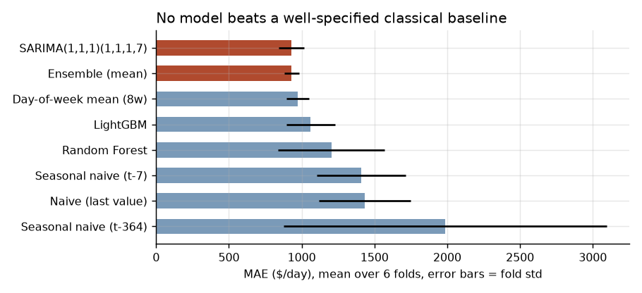
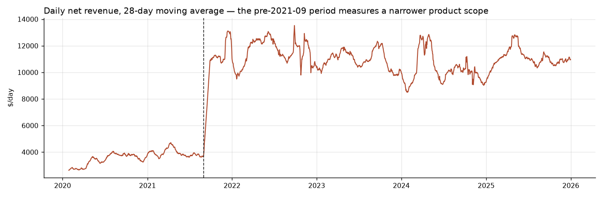
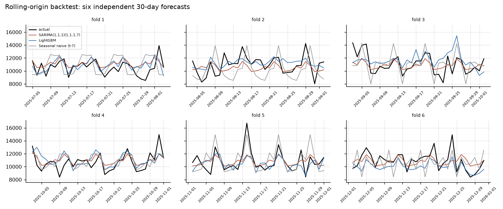
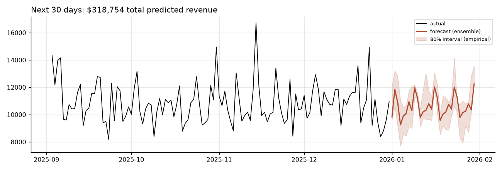

# Retail Demand Forecasting & Experiment Design Case Study 

Forecasting daily revenue for a single-location gas station convenience store
from 4.3 years of point-of-sale transactions, with a rolling-origin backtest
comparing eight models against four baselines.

**Headline result: the machine learning models lose.** A SARIMA model and an
eight-week day-of-week average both beat a tuned LightGBM. That result is
reported rather than buried, and the reasoning is in
[`REBUILD_GUIDE.md`](REBUILD_GUIDE.md).

---

## Results

30-day horizon, mean across 6 rolling origins (Jul–Dec 2025):

| Model | MAE ($) | MAE std | MAPE % | MASE |
|---|---|---|---|---|
| **SARIMA(1,1,1)(1,1,1,7)** | **929** | 85 | 8.63 | **0.518** |
| Ensemble (SARIMA + LGBM + DoW) | 930 | **50** | 8.64 | 0.518 |
| Day-of-week mean (8w) | 973 | 77 | 9.04 | 0.542 |
| LightGBM (L1) | 1,062 | 168 | 9.86 | 0.592 |
| Random Forest | 1,227 | 354 | 11.38 | 0.684 |
| Seasonal naive (t−7) | 1,407 | 306 | 13.04 | 0.783 |
| Naive (last value) | 1,435 | 315 | 13.84 | 0.798 |

MASE < 1 means the model beats an in-sample seasonal-naive forecast.
The shipped model is the ensemble: same accuracy as SARIMA, 40% less
fold-to-fold variance.



---

## Two data defects found during the audit

**1. Sales tax was being counted as revenue.** The `Sales Tax` rows are derived,
not observed — they equal 7.02% (± 0.09pp) of the taxable departments, i.e.
Florida's 6% state rate plus the 1% Brevard County surtax. It is a liability
owed to the state. Excluded.

**2. A reporting change was being read as business growth.** Six departments —
including all three fuel grades — appear in the export on 2021-09-01. Revenue
before that date measures a narrower product scope and is not comparable, so
the apparent 2020→2022 growth is largely an artifact. All modeling starts
2021-09-01 (1,583 clean daily observations).



---

## Method

Daily revenue is forecast 30 days ahead using **direct multi-step** modeling:
each training row is a `(forecast_origin, target_date)` pair with `days_ahead`
as a feature, and every history-based feature is computed at the origin and
shifted forward. This guarantees no feature uses information unavailable at
forecast time — `lag_1` does not exist when you are predicting 30 days out.

Features: origin-based rolling means/std/medians (7/14/28/91d), same-weekday
recent means, ±1 week year-ago lags, day-of-week, payday windows, Fourier
yearly seasonality, US/FL holiday proximity, and optional EIA weekly retail
fuel prices joined as-of the forecast origin.

Validation: 6 rolling origins spaced 30 days apart. No random splitting.



---

## Reproduce

```bash
pip install -r requirements.txt
cp <your-export>.xlsx data/raw/sales_data_2020_2025.xlsx

python scripts/01_audit_and_build.py            # audit + clean daily series
export EIA_API_KEY=...                          # optional
python scripts/02_fetch_eia.py                  # optional external regressor
python scripts/03_backtest.py                   # model comparison (~3 min)
python scripts/04_final_forecast.py             # forecast + charts
python scripts/05_evaluation_protocol_demo.py   # why not train_test_split
pytest tests/ -q
```

---

## Forecast

Next 30 days: **$318,756** total (80% interval $287,210–$351,497). Intervals are
empirical — per-horizon quantiles of backtest residuals, no distributional
assumption.



---

## Experimentation (design only — no test was run)

A separate component designs a **switchback experiment** for a
fuel-purchase-to-store-conversion promotion and validates the analysis pipeline
offline. There is no experiment in this data and no treatment was ever applied;
this is power/feasibility analysis and an A/A calibration on historical days.

- **Feasibility:** only the *aggregate* inside-merchandise metric has enough
  signal to test — every individual department's minimum detectable effect
  exceeds any plausible promo lift, even at 16 weeks. Best-adjusted MDE is ~9% of
  base at 8 weeks, ~7% at 16 weeks, so the design is honest about being
  underpowered for a realistically-sized effect.
- **A/A calibration:** the intended pipeline (day-level randomization + CUPED
  regression adjustment, analyzed once) holds its nominal 5% false-positive rate;
  mismatching the analysis unit to the assignment unit and daily peeking are
  shown — with reproducible numbers — to break it.

→ [`EXPERIMENT_DESIGN.md`](EXPERIMENT_DESIGN.md) (pre-registered analysis plan)
· [`EXPERIMENT_RESULTS.md`](EXPERIMENT_RESULTS.md) (power tables, A/A results)

```bash
python scripts/06_power_analysis.py    # feasibility, MDE, variance reduction, power curves
python scripts/07_aa_test.py           # A/A calibration (2,000 iterations, ~2 min)
```

## Caveats

- Lottery is recorded as **gross** ticket sales; the store earns roughly a 5–6%
  commission. Fuel is high-volume, low-margin. This is a revenue model, not a
  profit model — the export contains no margin data.
- One store, one location. Nothing here generalises to other sites.
- The model cannot anticipate regime changes (new competitor, fuel-price shock,
  road closure). Monitoring plan: track rolling 30-day MAE against the backtest
  fold distribution and alert when it exceeds the fold maximum.

## Repo layout

```
src/       config, data_prep, features, models, backtest, experiment
scripts/   numbered, run in order (01–05 forecasting, 06–07 experiment design)
tests/     23 tests (test_features.py + test_experiment.py)
reports/   generated tables and figures
EXPERIMENT_DESIGN.md / EXPERIMENT_RESULTS.md   switchback design + A/A validation
```
